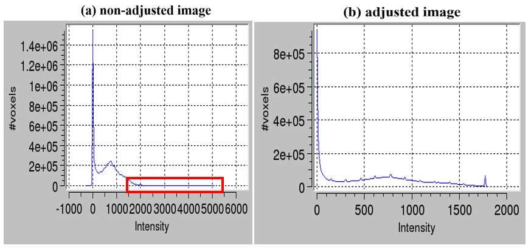
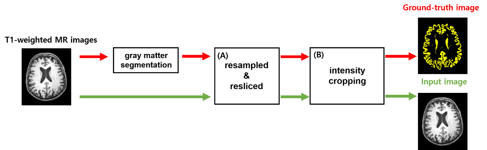
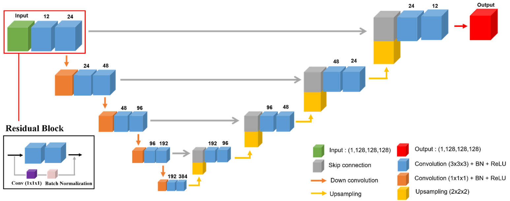
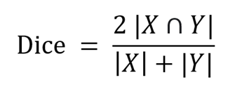
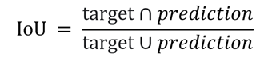
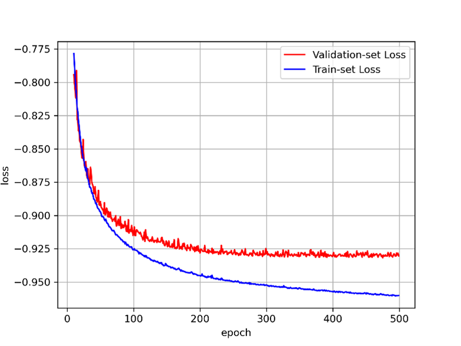
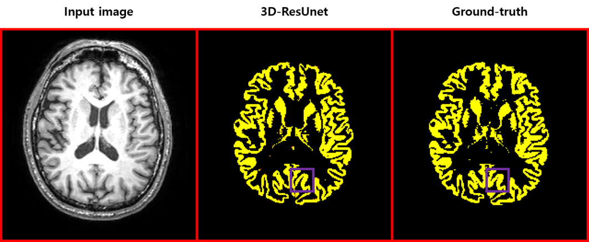
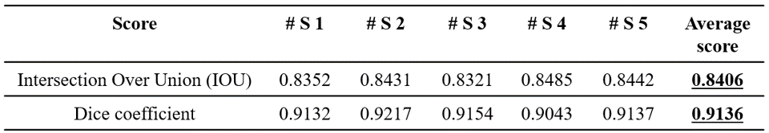
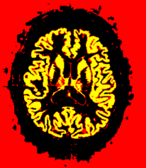

# 소개
본 연구에서는 T1 강조 자기공명영상에서 회백질 영역을 분할하는 영상 분할 알고리즘을 구현하고자 함.  

본 연구의 주안점은 시간이 소요되는 기존 영상 분할 작업을 딥러닝 알고리즘으로 대체하여 정확도를 유지하면서도 처리 시간을 단축하고 기존 영상 분할 작업의 문제점이였던 영상의 잡음(noise) 유무에 관계 없이 영상 분할을 처리하는 것을 기대 함.

# 순서: 
1. 데이터 셋 소개
2. 데이터 전처리
3. 딥러닝 모델, 3D-ResUnet
4. 학습 방법
5. 정량적 평가 방법
6. 실험 결과 및 

## 1. 데이터 셋 소개
본 연구에서 사용한 데이터는 알츠하이머 병 뇌 영상 데이터베이스(ADNI)로 부터 획득함.  

ADNI 데이터셋에서 65명의 자기공명영상을 사용하였으며 이 중 50명의 환자 영상을 훈련 데이터로, 10명 환자 영상을 검증 데이터로, 나머지 5명을 테스트 데이터로 설정하고 학습 및 실험을 진행함.

(50, 256, 256, 256, 1) # __Train data shape__  
(10, 256, 256, 256, 1) # __Validation data shape__  
(5, 256, 256, 256, 1) # __Test data shape__  

## 2. 데이터 전처리
딥러닝 모델에 넣어주기 위해 모든 영상의 크기를 일정하게 통일함.  

SPM 패키지를 이용하여 영상 데이터의 크기를 __표준뇌 참조 영상__ 과 같아지도록 **Reslice**하여 준비함.  
(표준뇌 영상 크기: 복셀 사이즈 1 x 1 x 1 mm3, 크기 256 x 256 x 256).

Reslice 과정을 거친 영상은 대부분의 intensity들이 0 근처에 모여있지만, 일부 intensity가 매우 큰 복셀이 나타남.  
intensity의 히스토그램 분석을 통해 상위 99% 이상은 99%의 값으로 처리하는 intensity cropping을 시행하여 범위를 제한함[그림 1]. 

</>

* [그림 1] 특정 이미지의 (a) 원래 이미지의 복셀 값 범위, (b) intensity cropping을 실시하여 보정한 이미지의 복셀 값 범위 *
</>  
  
  
자기공명영상에 대한 회백질 마스크는 SPM 패키지의 영상 분할 작업을 시행하여 획득하였고, FSL을 이용하여 이진 마스크로 구성함.  

</>

* [그림 2] 데이터 전처리 전체 흐름도 *
</>  

## 3. 딥러닝 모델, 3D-ResUnet
본 연구에서는 사용한 **3D-ResUnet [그림 3]** 은 [패치 기반(patch-based)](https://github.com/wjh1065/3D-Patch-Based-Training) [그림 4]으로 변형하여 사용함.  

</>

* [그림 3] 3D-ResUnet의 구조 도식화 *
</>  

</>

* [그림 4] Patch 학습 예시 *
</>  

(50, 256, 256, 256, 1) -> (400, 128, 128, 128, 1) # Train __*patch*__ data shape  
(10, 256, 256, 256, 1) -> (80, 128, 128, 128, 1)   # Validation __*patch*__ data shape  
(5, 256, 256, 256, 1) -> (40, 128, 128, 128, 1)   # Test __*patch*__ data shape  

## 4. 학습 방법
"자기공명영상"을 __입력 데이터__ 로 사용하였고, "회백질 이진 마스크"는 __정답 데이터__ 로 사용하여 학습을 진행함.  

다이스 계수(Dice coefficient, 식 (1))를 손실함수로 사용하여, 입력 데이터에서 정답 데이터로 학습하도록 함.  

</>

* [식 1] 다이스 계수 공식 *
</>  

두번째로 사용한 함수는 Intersection over union(IOU, 식 (2))를 사용하여, 다이스 계수와 IOU 측정칭 대한 비교를 진행함.  

</>

* [식 2] IOU 공식 *
</> 

본 연구에서는 패치를 이용하여 한 사람의 영상을 8개의 패치(각 영상의 실제 크기: 128 x 128 x 128 voxels)로 나누고, 미니배치의 크기(batch size)를 2로 하였으며, 총 500번의 에폭(epoch) 동안 학습을 진행하였다. 최적화 알고리즘(optimizer)는 Adam을 사용했다.  

모든 구현은 유닉스 상(Ubuntu 18.04.5 LTS)의 Python 버전 3.8.8에서 구글 텐서플로우 (TensorFlowTM) 버전 2.5.0, 케라스(Keras) 버전 2.5.0으로 구현되었다. 학습에 사용된 하드웨어 정보는 다음과 같다 (CPU: Intel i7-6700@3.4GHz, GPU: Nvidia RTX 3090 24GB, memory: 48GB).

## 5.  실험결과 및 고찰
그림 5는 최종 모델의 학습 곡선을 보여줌.  과적합을 막기 위해 검증 데이터에서의 손실이 더 이상 증가하지 않는 정도에서 학습을 멈춤.  

</>

* [그림 5] ADNI 데이터에 대해 3D-ResUnet의 학습 및 검증 다이스 손실 그래프 *
</> 

그림 6은 ADNI 테스트 데이터 첫번째 영상을 예시로 그린 것임.  

</>

* [그림 6] 테스트 데이터에서의 모델 처리결과 예시 *
</>

* (입력 영상, 3D-ResUnet의 결과 영상, SPM으로 영상 분할 처리된 정답 영상) *
</>  

* (3D-ResUnet 결과 영상의 IOU: 0.8352, dice coeff: 0.9132) *
</>  

표 1은 ADNI 테스트 데이터 5명에 대한 정량적 비교 결과를 보여줌.  

</>

* [표 1] ADNI 테스트 데이터 5명에 대한 정량적 비교 *
</>

본 연구에서는 영상 분할 과정을 딥러닝 알고리즘(3D-ResUnet)으로 학습하는 연구를 진행함.  
시각적 비교 결과, 정답 영상과 예측 영상이 거의 유사 했으나 수치적으로 점수를 비교하면 기존 과정의 정확도보다 낮게 나옴.  

예측 시 영상 배경에 잡음이 생기게 되는데(그림 7), 이는 정확도를 검사할 때 점수를 낮게 만드는 요인 중 하나라고 생각됨.
예측 영상을 이용하여 후처리 과정을 통해 잡음을 제거하면 기존 결과보다 더 뛰어난 성능이 나올 것이라 생각됨.  

</>

* [그림 7] 예측 영상의 배경 잡음 *
</>

### 자세한 내용은 아래 파일 확인.

[자료](https://drive.google.com/file/d/1i-FrVqro_EcoaMggkxfeSW9pPQNBAhfD/view?usp=sharing)  
[발표](https://youtu.be/STwbK5M6tT0)

